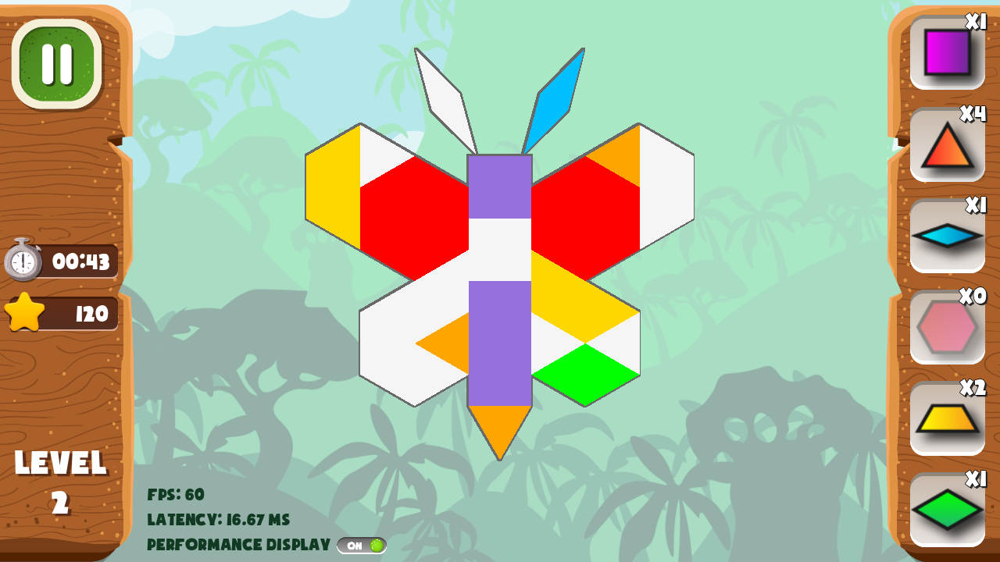
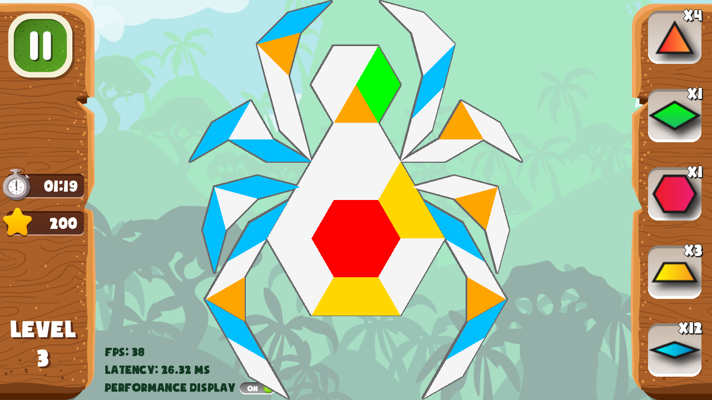
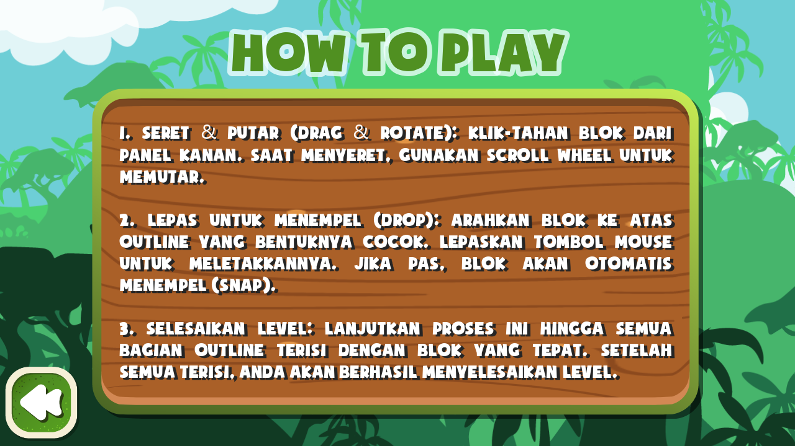
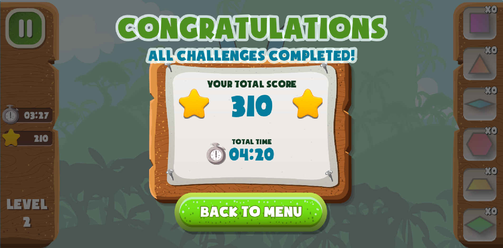

# Proyek Godot ETS Komputer Grafik: Outline Quest - Permainan Pattern Block Activity

Proyek komputer grafik yang dibuat menggunakan [Godot Engine](https://godotengine.org/) dan ditulis dalam bahasa pemrograman C#.

## About Author

- Nama: Ikhsan Satriadi
- NIM: 241511080
- Kelas: 2C
- Prodi: D3 Teknik Informatika

## Preview

| Level 1                                         | Level 2                                                         | Level 3                                               |
| ----------------------------------------------- | --------------------------------------------------------------- | ----------------------------------------------------- |
|          |                          |                |
| **How To Play**                                 | **Challenge Completed**                                         | **Game Completed**                                    |
|  |  |  |
